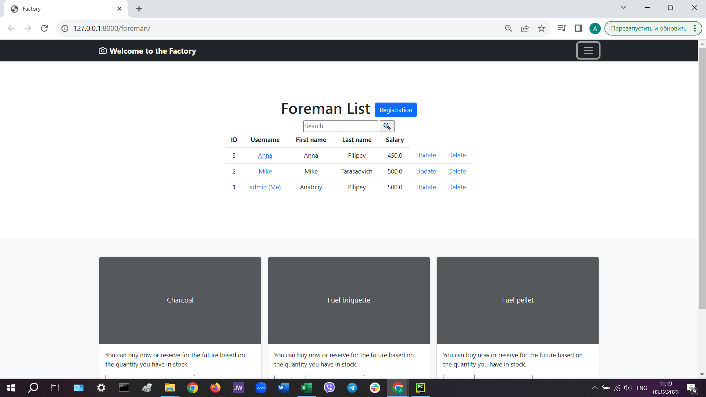

# <center >Production-plant</center>
In a factory it is necessary to keep a record of the products made during a Shift. There is a Foreman (user) at the head of the Shift. There are several Workmen on the Shift. Each Workman has WorkCommitments. With this information we will know:
* how much production there is,
* we can also compare shifts,
* see what we need to produce more,
* analyze the cost of production.
 

---
           

## <center >Manual Build</center>
1. In Pycharm, open the folder where the project will be stored.
2. Cloning the project.  
    ```shell
    git clone https://github.com/AnatoliyPilipey/production-plant.git
    ```
3. Go to the folder with the project.  
    ```shell 
    cd production-plant
    ```
4. Creating a virtual environment.  
    ```shell 
    python -m venv venv
    ```
5. Activating the virtual environment.  
    * For Apple 
    ```shell     
    source env/bin/activate
    ```
    * For Windows  
    ```shell 
    venv\Scripts\activate
    ```
6. Install the required modules from the specified list.  
    ```shell 
    pip install -r requirements.txt
    ```
7. Create an .env file and put the secret key in it.  
    ```shell 
    password = "django-insecure-jgd9@7+bs^s%cq-!zypmq7a@r0y6v3ckwk0#(+b3s3(3m*8qmw"
    ```
8. Perform database creation migrations.  
    ```shell 
    python manage.py migrate
    ```
9. Using the fixture with test data, we fill the database.  
    ```shell 
    python manage.py loaddata db.json
    ```
10. Running the server  
    ```shell 
    python manage.py runserver
    ```
11. At this point, the app runs at  
    ```shell 
    http://127.0.0.1:8000/
    ```
12. Use login and password to log in to the database.  
    ```shell 
    admin
    ```  
    ```shell 
    zaq12wsx
    ```

## Demo  


_Thank you for familiarizing yourself with my work._
